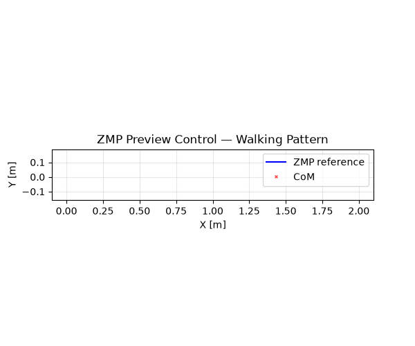

<p align="center">
  
</p>

<h1 align="center">🤖 ZMP Preview Control — Walking Pattern Generator</h1>

<p align="center">
  <a href="https://github.com/ekorudiawan/ZMP-Preview-Control-WPG"></a>
  <a href="https://www.mathworks.com/products/matlab.html"></a>
  <a href="https://www.python.org"></a>
  <a href="https://github.com/ekorudiawan/ZMP-Preview-Control-WPG/blob/master/LICENSE"></a>
</p>

Zero Moment Point (ZMP) **Preview Control** for biped walking pattern generation,
ported from MATLAB to **pure Python** with no proprietary dependencies.

---

## Features

| What | How |
|------|-----|
| **Preview controller gains** | Discrete LQR with Riccati equation → `Gi`, `Gx`, `Gd` |
| **Walking pattern simulation** | ZMP→CoM trajectory tracking via cart-table model |
| **Zero MATLAB dependencies** | `python-control` + NumPy + SciPy |
| **CLI** | `zmp-preview-ctl params | simulate | gif` |
| **Animated GIF output** | Visualise walking pattern evolution frame-by-frame |

## Quick start

```bash
pip install -r requirements.txt
pip install -e ".[gif]"

# Compute preview control gains
zmp-preview-ctl params

# Run simulation + save plot
zmp-preview-ctl simulate --output zmp_com.png

# Generate animated GIF
zmp-preview-ctl gif --output walking.gif
```

Or in Python:

```python
from zmp_preview_control.params import get_preview_control_parameter
from zmp_preview_control.simulation import simulate

# Compute gains
A_d, B_d, C_d, Gi, Gx, Gd = get_preview_control_parameter(
    zc=0.22, dt=0.01, t_preview=1.0, Qe=1e-4, R=1e-6
)

# Full simulation → (zmp_x, zmp_y, com_x, com_y)
zmp_x, zmp_y, com_x, com_y = simulate()
```

## How it works

The **Linear Inverted Pendulum Model** (LIPM) approximates a walking biped as a point mass
at constant height `zc` above the ground. The preview controller computes the lateral jerk
that steers the **CoM** (Center of Mass) to track a desired **ZMP** (Zero Moment Point)
reference from a footstep plan.

```
State:  x = [p, v, a]ᵀ  (CoM pos, vel, accel in one axis)
Output: y = [1, 0, -zc/g] · x  (ZMP)
Goal:   track reference r(t) with preview of future N steps
```

The optimal gain `K = [Gi, Gx]` is solved via discrete LQR on the augmented system
(error integrator + state). Preview gains `Gd(n)` are then computed recursively.

### Parameters

| Param | Default | What it does |
|-------|---------|--------------|
| `zc` | 0.22 m | LIPM height (CoM above ground) |
| `dt` | 0.01 s | Simulation time step |
| `t_step` | 0.6 s | Duration per footstep |
| `t_preview` | 1.0 s | Preview horizon |
| `Qe` | 1e-4 | Weight on ZMP tracking error |
| `R` | 1e-6 | Weight on jerk (control effort) |

Tune `Qe` / `R` to adjust tracking responsiveness vs. smoothness.

## Project structure

```
ZMP-Preview-Control-WPG/
├── zmp_preview_control/         # Python package (pure Python port)
│   ├── __init__.py
│   ├── params.py                # get_preview_control_parameter()
│   ├── simulation.py            # create_zmp_trajectory(), calc_preview_control()
│   └── cli.py                   # CLI entry point
├── sources/                     # Original MATLAB + legacy Python
│   ├── get_preview_control_parameter.m
│   ├── calc_preview_control.m
│   ├── create_zmp_trajectory.m
│   ├── ZMP Preview Control.ipynb
│   └── zmp_feedforwad_control.py
├── images/                      # Output plots & animations
├── scripts/generate_demo.py     # GIF generation script
├── pyproject.toml
├── requirements.txt
└── .github/workflows/ci.yml
```

## MATLAB → Python port

| MATLAB | Python equivalent |
|--------|------------------|
| `ss(A,B,C,D)` | `control.ss()` |
| `c2d(sys_c, dt)` | `control.c2d()` |
| `dlqr(A, B, Q, R)` | `control.dlqr()` |
| `.mat` save/load | `np.savetxt()` / `numpy` native |

The original MATLAB code and the pre-computed `wpg_parameter.mat` are preserved
in `sources/` for reference. The new Python package computes everything from scratch.

## Changelog

### v2.0.0 (2026)

- **Pure Python** — no MATLAB / Control Systems Toolbox required
- `zmp_preview_control` package with clean API
- CLI: `zmp-preview-ctl params | simulate | gif`
- Animated GIF output
- GitHub Actions CI
- MIT license

### v1.0 (2019)

- Original MATLAB implementation with Python feedforward script

## License

MIT — see [LICENSE](LICENSE).
